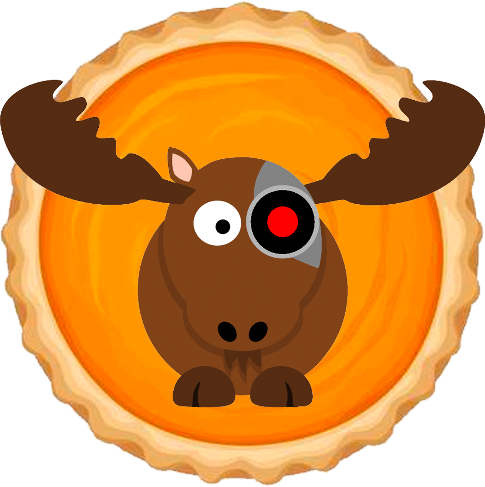

# MoosePy
A python robotics library for interfacing with [RobotMoose](https://github.com/robotmoose/robotmoose) 

## Summary
MoosePy offers functionality for driving and retreiving sensors values from robots deployed using RobotMoose. It supports arbitrary robot configurations using the JSON structure found on the central command server.

## Installation
1. Download the latest supported version of Python3

2. Install the library with following pip command:
   ``` shell
    pip3 install moosepy
   ```

   MoosePy uses the `requests` library, which can be installed using the following command if you are experiencing dependency issues:
   ``` shell
   pip3 install requests
   ```

## Setup

Instantiating a robot object is dependent on two parameters:

| Required Parameter |      Description     |
|:------------------:|:--------------------:|
|  `superstar_path`  |The path after https://robotmoose.com/superstar/\|
|                    |For example, if the path to your robot is https://robotmoose.com/superstar/robots/20xx-yy/uaf/robotName then `superstar_path = robots/20xx-yy/uaf/robotName`|
|      `password`    | The robot's password |

``` python
import moosepy

# The path after https://robotmoose.com/superstar/
superstar_path = "robots/20xx-yy/uaf/robotName"
password = "password"

robot = moosepy.Robot(superstar_path, password) 
```